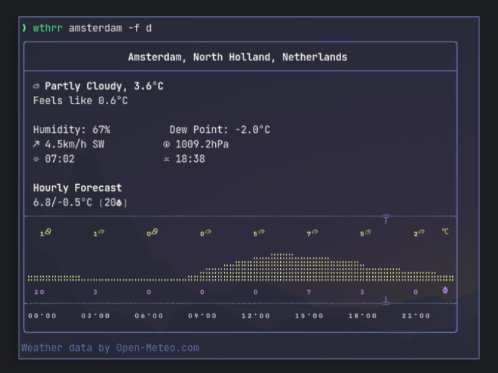

# 🌤️ Rust Weather App 🌦️

Welcome to the **Rust Weather App**, a simple command-line application that fetches and displays the current weather for any city using the OpenWeatherMap API. ☁️🌍

## 📋 Features
- 🔍 Fetch current weather information by city name.
- 🌡️ Display temperature, humidity, and weather conditions.
- 🌎 Easy to extend with more features, such as forecasts or additional data.

 ## 📸 Rust Weather App 
 
  
*Experience how it work!*

## 🚀 Getting Started

### 1. Prerequisites
Make sure you have [Rust](https://www.rust-lang.org/tools/install) installed on your machine. You can install Rust by running the following command:

```bash
curl --proto '=https' --tlsv1.2 -sSf https://sh.rustup.rs | sh
```

### 2. Clone the Repository
Clone this repository to your local machine:

```bash
git clone https://github.com/chrohangurjar1/rust_weather_app.git
cd rust_weather_app
```

### 3. Add Dependencies
Open the `Cargo.toml` file and ensure the following dependencies are included:

```toml
[dependencies]
reqwest = { version = "0.11", features = ["json"] }
tokio = { version = "1", features = ["full"] }
serde = { version = "1.0", features = ["derive"] }
serde_json = "1.0"
```

### 4. Set Up Your API Key
1. Sign up at [OpenWeatherMap](https://openweathermap.org/) and create an API key. 🔑
2. Replace `YOUR_API_KEY` in `src/main.rs` with your actual API key.

### 5. Run the Application
Build and run the application:

```bash
cargo run -- <CityName>
```

Replace `<CityName>` with the name of the city you want to check the weather for, like `London` or `New York`. 🌆

#### Example:
```bash
cargo run -- London
```

## 🌟 Contributors

We want to give a huge shoutout to everyone who has contributed to the project! 🙌 Your hard work and dedication help make this app better every day. 💪

<a href="https://github.com/chrohangurjar1/RustWeatherApp/graphs/contributors">
  
</a>

🎉 Thank you all for your amazing contributions! Let's keep building together. 🚀

## 📄 License
This project is licensed under the MIT License. See the [LICENSE](LICENSE) file for details.

## 📬 Contact
For any questions or feedback, feel free to reach out!


---
Happy coding! 🎈
---
